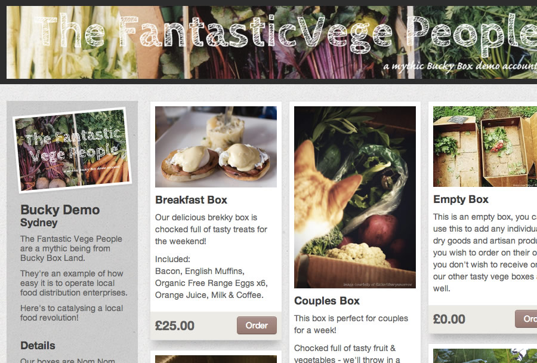

# Bucky Box Web Store

[](https://travis-ci.org/buckybox/webstore)
[](https://codeclimate.com/github/buckybox/webstore)
[](https://gemnasium.com/buckybox/webstore)

Bucky Box Web Store is an extraction from the [Bucky Box](http://www.buckybox.com/) platform.



## Configuration

See [config/application.yml](https://github.com/buckybox/webstore/blob/master/config/application.yml.example).
The required settings are `BUCKYBOX_API_KEY`, `BUCKYBOX_API_SECRET` and `SECRET_KEY_BASE`. You can leave the rest blank.

## Services

You must have [Redis](http://redis.io/) running - it is used for transient data.

## Deployment instructions

```bash
cp config/application.yml.example config/application.yml
```

TBD

## Contributing

TBD

## Translation

You can help translate it into your favorite language. We use [Transifex](https://www.transifex.com/projects/p/buckybox-webstore/).

## License

GPLv3+

